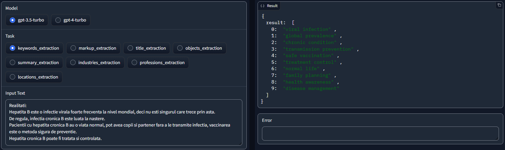
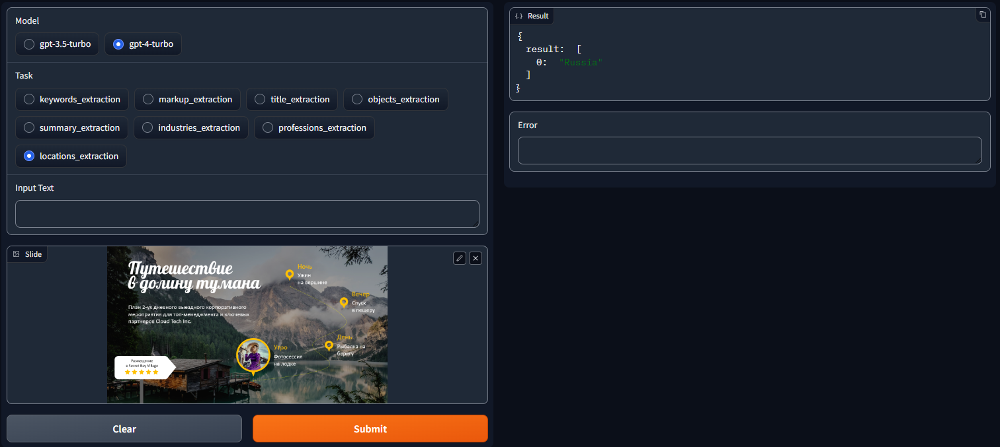

# Slide_Analyzer

A tool for extracting the target information from slides (slide can be either text or an image).

## Usage
Specify all the required values in the `config.py` and `./prompts/prompts_mapping.py`, then run
```bash
$ python main.py
```
As a result, the extracted data will be saved in a dataframe.  


For testing via gradio interface, run
```bash
$ python gradio_interface.py
```

## Usage
Specify all the required values in the `config.py`, then run
```bash
$ python main.py
```
As a result, the extracted data will be saved in a dataframe.  


For testing via gradio interface, run
```bash
$ python gradio_interface.py
```

## What data can be extracted
* `keywords/associations`
* `markup`
* `title`
* `recommended objects`
* `summary`
* `predicted industries`
* `predicted autor's professions`
* `predicted autor's locations`

## Some examples
<p>
  Keywords extraction from slide text
  
  Predicted autor's locations for slide
  
</p>
